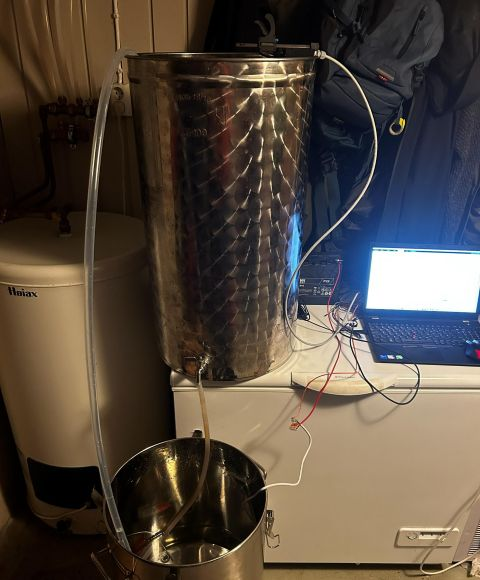
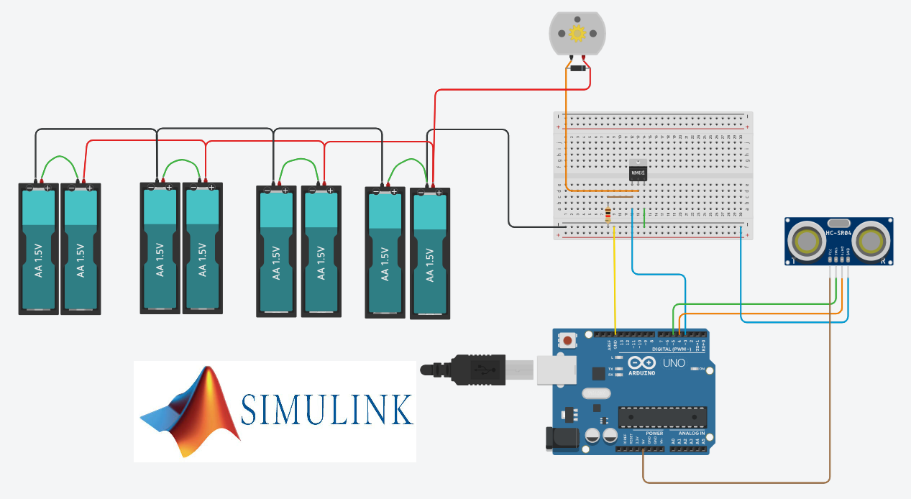
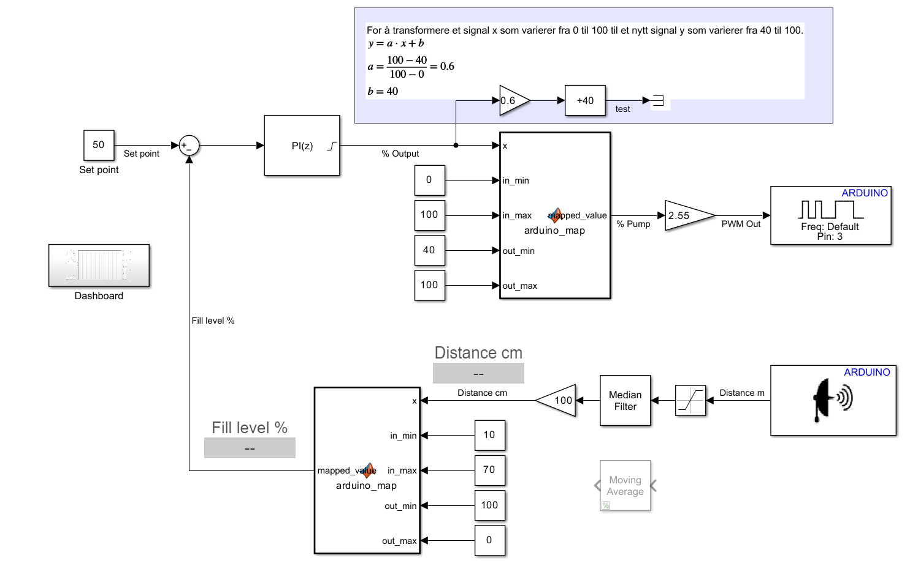

# 💧 Nivåregulering av balansetank til saftpastør

Dette prosjektet implementerer et lukket reguleringssystem for nivåmåling og pumpekontroll.
En MATLAB Simulink-modell kommuniserer med en Arduino Uno R4 WiFi via USB.
Arduinoen fungerer som hardware-interface mellom ultralydsensor og pumpe (via MOSFET).

---

# 📷 Bilde av prosjektet



## 🎥 Video som viser prosjektet i drift

<video src="https://github.com/aiboee/Semesterprosjekt-Gruppe11/raw/refs/heads/main/videos/Video1-540x960.mp4" controls></video>


## 🖼️ Bilder

| Systemoversikt                        | Simulink-modell                         |
| ------------------------------------- | --------------------------------------- |
|   |  |

---

# 📂 Prosjektstruktur

```bash
📂 docs/
   ├── presentasjon.pdf             # Powerpoint presentasjon (.pdf format)
   ├── presentasjon.pptx            # Powerpoint presentasjon (.pptx format)
   └── koblingsskjema.pdf           # Koblingsskjema (.pdf)

📁 images/                          # Bilder brukt i README

📂 matlab/
   ├── LevelControl_2025a.slx       # Simulink-modell (.slx) for MATLAB 2025a
   └── LevelControl_2025a.slx       # Simulink-modell (.slx) for MATLAB 2025b

📁 videos/                          # Video brukt i README

README.md
```
---

# 🧠 Systemoversikt

## 🔹 Beskrivelse


* Simulink modell brukes for programmering av Arduino
* Kommunikasjon mellom PC og Arduino via (USB)
* Arduino kjører kode generert fra Simulink og håndterer sensor og aktuator
* Dashboard i Simulink mottar målerverdier fra Arduino og sender settpunkt tilbake

## 🔹 Blokkdiagram


```md

```

---

# ⚙️ Maskinvare

* PC til kjøring av MATLAB og Simulink
* Arduino Uno R4 WiFi
* Sensor: Ultralyd avstandssensor (HC-SR04) med 3D-printet kapsling
* Aktuator: Nedsenkbar pentrypumpe, 12 V (Biltema, Art.nr. 25-9803)
* Strømforsyning: 12 V blybatteri for drift av pumpe, Arduino forsynes via USB tilkobling til PC
---

# 💻 Programvare

* MATLAB (versjon: 2025b)
* Simulink
* Simulink Support Package for Arduino Hardware


---

# 🚀 Installasjon og bruk

## 1️⃣ Klon repoet

```bash
git clone https://github.com/aiboee/Semesterprosjekt-Gruppe11
```

## 2️⃣ Åpne koblingsskemaet og koble opp komponentene

Gå til:

```bash
📁 docs/
```

Åpne `koblingsskjema.pdf`-filen og koble opp komponentene i henhold til koblingsskjemaet.

## 3️⃣ Åpne Simulink-modellen

Gå til:

```bash
📂 matlab/
   ├── LevelControl_2025a.slx       # Simulink-modell (.slx) for MATLAB 2025a
   └── LevelControl_2025a.slx       # Simulink-modell (.slx) for MATLAB 2025b
```

Åpne `.slx`-filen i MATLAB. (Husk å velge rett fil basert på versjonen av MATLAB du har)

## 4️⃣ Koble til Arduino

* Koble Arduino til PC ved hjelp av en USB kabel
* Velg riktig COM-port i Simulink
* Velg **Run on board (External mode)**
* Klikk **Monitor & Tune**

## 5️⃣ Koble til Arduino
* Du kan nå justere settpunkt på dasboard i simulink
* Du får grafisk visning av settpunkt, målt nivå og pådrag på pumpen

---

# 📊 Funksjonalitet

* ✅ Visualisering i Simulink
* ✅ Sanntids kommunikasjon
* ✅ Sensoravlesning
* ✅ Aktuatorstyring
* ⬜ Fremtidige forbedringer

---

# 📄 Dokumentasjon

Full dokumentasjon finnes i:

```bash
📁 docs/
```

Inneholder:

* 📘 Presentasjon av prosjektet
* 📐 Koblingsskjema

---

# 🛠️ Videre arbeid

* 
* 
* 
* 

---

# 👥 Bidragsytere

Arnt Inge Bøe  
Einar Lønne   
Eirik Hausberg


Automatisering / Fagskolen Rogaland  

---

# 📜 Lisens

Kun for undervisningsformål.